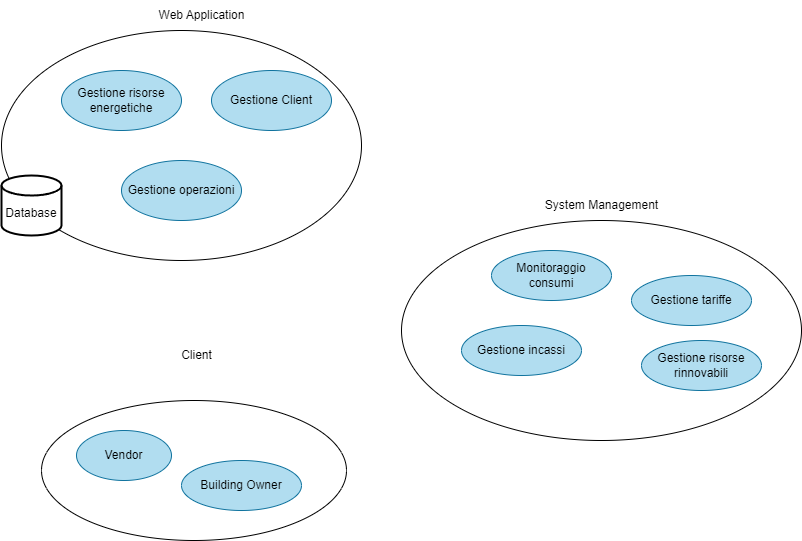
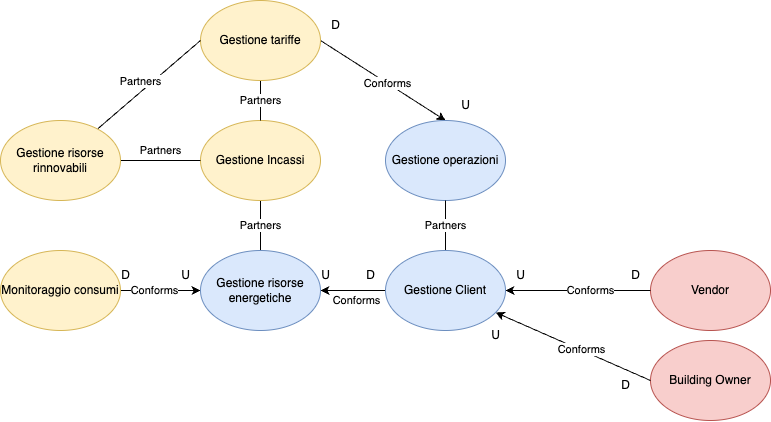

# Bounded context

Dopo aver individuato i diversi sotto-domini di cui si compone il sistema, si è passati alla definizione e individuazione dei diversi bounded context che possono essere contenuti al loro interno. 

Il sub-domain **Web Application** si compone di tre diversi bounded context:

- **Gestione Risorse Energetiche**, implementa la logica per la visualizzazione delle risorse e la gestione dei dati relativi ad esse;
- **Gestione Client**, racchiude la logica per la gestione degli account utente, le informazioni e i dati personali;
- **Gestione Operazioni**, racchiude tutta la logica per la gestione di diverse operazioni, effettuabili da qualsiasi tipo di account.

Il sub-domain **System Management** presenta al suo interno quattro bounded context che sono:

- **Monitoraggio consumi**, gestisce la visualizzazione dei consumi delle varie risorse energetiche;
- **Gestione incassi**, gestisce l'invio e la ricezione delle invoices;
- **Gestione tariffe**, gestisce la modifica delle tariffe da parte delle organizzazioni;
- **Gestione Risorse Rinnovabili**, gestisce l'utilizzo e l'installazione di dispositivi rinnovabili.

Il sub-domain **Client** è costituito dai seguenti bounded-context:

- **Vendor**, rappresenta l'account utente di una organizzazione, che può vendere i suoi servizi nella Web Application;
- **Building Owner**, rappresenta l'account utente di un cliente che può registrare il proprio edificio sul sito e usufruire dei servizi delle organizzazioni.

Individuazione dei diversi bounded context del sistema

## Bounded context canvas

Per comprendere meglio cosa ci rappresentano i diversi bounded context e le comunicazioni che possono intercorrere fra di questi sono stati realizzati diversi bounded context canvas, riportati di seguito.

**Context canvas relativi al sub-domain: Web Application**

| Nome | Gestione Risorse Energetiche |
| --- | --- |
| Descrizione | Sono costituite da Gas, Luce e Acqua |
| Decisione di business | Aggiunta o aggiornamento dei sistemi esistenti; Riduzione spreco di energia |
| Ruolo nel dominio | Gestisce la vendita e visualizzazione dei dati delle risorse energetiche |
| Classificazione strategica | Rientra nel core domain di Web Application |
| Ubiquitous language |  |
| Inbound communication | Riceve i dati e le invoices dai relativi microservizi |
| Outbound communication | Invia i dati relativi alle risorse energetiche a Gestione Client |

| Nome | Gestione Client |
| --- | --- |
| Descrizione | È costituito dagli elementi che si occupano della gestione dei dati e delle informazioni relative agli utenti |
| Decisione di business | / |
| Ruolo nel dominio | Si occupa di mantenere la coerenza e la persistenza delle operazioni effettuate dai client |
| Classificazione strategica | Rientra nel core domain di Web Application |
| Ubiquitous language |  |
| Inbound communication | Riceve dai relativi microservizi le informazioni relative ai clients |
| Outbound communication | Invia al database le informazioni relative ai nuovi utenti o alle modifiche di users; Invia i dati al Client |

| Nome | Gestione Operazioni |
| --- | --- |
| Descrizione | È rappresentato da tutta la parte logica per la gestione delle diverse operazioni effettuabili dai clients |
| Decisione di business | / |
| Ruolo nel dominio | Permette di gestire le operazioni di interazione tra l'utente e l'applicazioni, come ad esempio la registrazioni di un muovo edificio o la modifica dei parametri di uno già registrato |
| Classificazione strategica | Rientra nel core domain di Web Application |
| Ubiquitous language |  |
| Inbound communication | Riceve le richieste dal generic sub-domains Client |
| Outbound communication | Invia i dettagli delle informazioni al database per tenere la persistenza delle modifiche |

**Context canvas relativi al sub-domain: System Management**

| Nome | Monitoraggio consumi |
| --- | --- |
| Descrizione | Rappresenta il modulo che visualizza lo stato dei consumi dell'abitazione |
| Decisioni di business | / |
| Ruolo nel dominio | Si occupa di pulire i dati e visualizzarli per l'utente  |
| Classificazione strategica | Rientra nel support domain sistema di System Management |
| Ubiquitous language |  |
| Inbound communication | Riceve i dati da Gestione risorse energetiche |
| Outbound communication | Invia i dati elaborati a Gestione Client |

| Nome | Gestione incassi |
| --- | --- |
| Descrizione | Rappresenta il modulo che si occupa di trovare e inviare le invoices agli utenti per i loro edifici |
| Decisioni di business | / |
| Ruolo nel dominio | Si occupa di calcolare il costo totale in base al prezzo dell'organizzazione, alla quantità di energia utilizzata e alla produzione rinnovabile |
| Classificazione strategica | Rientra nel support domain sistema di System Management |
| Ubiquitous language |  |
| Inbound communication | Riceve i dati da Gestione risorse energetiche, gestione risorse rinnovabili e gestione tariffe |
| Outbound communication | Invia i dati elaborati a Gestione Client  |

| Nome | Gestione tariffe |
| --- | --- |
| Descrizione | Rappresenta il modulo che gestisce tutte le operazioni per modificare le tariffe dell'organizzazione |
| Decisioni di business | / |
| Ruolo nel dominio | Si occupa di memorizzare e di aggiornare le varie informazioni sulla tariffe e sui servizi offerti da una organizzazione |
| Classificazione strategica | Rientra nel support domain sistema di System Management |
| Ubiquitous language |  |
| Inbound communication | Riceve le informazioni da memorizzare da Gestione operazione |
| Outbound communication | Invia i dati al Client e alla Gestione incassi |

| Nome | Gestione Risorse Rinnovabili |
| --- | --- |
| Descrizione | Rappresenta il modulo che gestisce tutte risorse rinnovabili |
| Decisioni di business | / |
| Ruolo nel dominio | Si occupa di memorizzare e mostrare i vari dispositivi rinnovabili e il loro costo |
| Classificazione strategica | Rientra nel support domain sistema di System Management |
| Ubiquitous language |  |
| Inbound communication | Riceve le informazioni da memorizzare da Gestione operazioni |
| Outbound communication | Invia i dati al Client e alla Gestione incassi |

**Context canvas relativi al sub-domain: client**

| Nome | Vendor |
| --- | --- |
| Descrizione | Rappresenta l'account Vendor che si vuole realizzare |
| Decisioni di business | L’interfaccia deve essere user friendly e intuitiva per dell’utente |
| Ruolo nel dominio | Si occupa di permettere all'utente di creare una organizzazione con la quale poter vendere i suoi servizi |
| Classificazione strategica | Rientra nel generic domain client |
| Ubiquitous language | Bills, Production, KPI, Energy, Gas, Water, Invoices, Buildings, Organization, Earnings, Building Owner, Vendor |
| Inbound communication | Riceve i dati da mostrare all’utente dal bounded context Gestione Client |
| Outbound communication | Invia i dati relativi alle informazioni dell'organizzazioni e dei consumi tramite Gestione delle tariffe, Gestione degli incassi e Gestione delle rinnovabili |

| Nome | Building Owner |
| --- | --- |
| Descrizione | Rappresenta l'account Building Owner che si vuole realizzare |
| Decisioni di business | L’interfaccia deve essere user friendly e intuitiva per dell’utente |
| Ruolo nel dominio | Si occupa di permettere all'utente di creare un account con il quale poter usufruire dei servizi dell'applicazione  |
| Classificazione strategica | Rientra nel generic domain client |
| Ubiquitous language | Bills, Production, KPI, Energy, Gas, Water, Invoices, Buildings, Organization, Earnings, Building Owner, Vendor |
| Inbound communication | Riceve i dati da mostrare all’utente dal bounded context Gestione Client |
| Outbound communication | Invia i dati relativi alle operazioni eseguite dall'utente tramite Gestione Client e Gestione operazioni |

## Context map
Sulla base di quello che è stato descritto nei paragrafi precedenti, è stata creata una context map per rappresentare le relazioni tra i vari bounded context.

