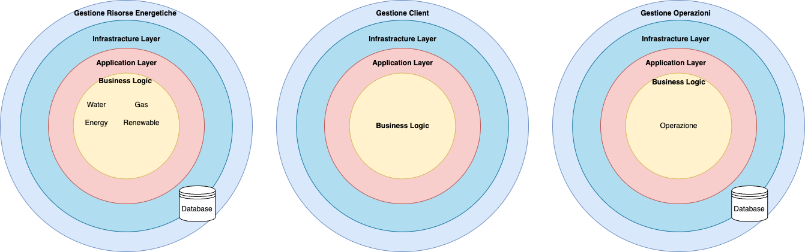

# Core domain: Web Application

Secondo le linee guida del Domain Driven Design, si consiglia di dare maggiore attenzione ai domini classificati come `core`. 
Nel nostro caso, il sub-domain core **Web Application** presenta le seguenti caratteristiche:

È composto da tre bounded context:
- **Gestione Risorse Energetiche**, implementa la logica per la visualizzazione delle risorse e la gestione dei dati relativi ad esse. 
L'entità del dominio che rientrano in questo bounded context includono: `Water`, `Gas`, `Energy` e `Renewable` .
- **Gestione Client**, racchiude la logica per la gestione degli account utente, le informazioni e i dati personali. Il concetto di `operazione` è incluso in questo bounded context.
- **Gestione Operazioni**, racchiude tutta la logica necessaria per la gestione delle diverse operazioni, effettuabili da qualsiasi tipo di account.

L'illustrazione successiva mostra in maggior dettaglio le caratteristiche relative ai bounded context del sub-domain descritto.

