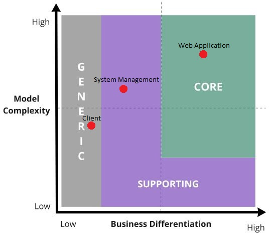

# Analisi dei sottodomini

Nel Domain Driven Design per poter meglio gestire la complessità del dominio che si vuole analizzare si consiglia di esplorare a fondo il problem-domain individuando sottodomini che siano più semplici da gestire, inoltre, è importante associare ad ognuno di questi sotto-domini individuati un’importanza: `core`, `generic`, `support`, in modo da aiutare gli sviluppatori a comprendere meglio quali sono gli aspetti principali su cui ci si dovrà concentrare. 

Per il problema in esame, il tema di sviluppo a seguito del processo di knowledge crunching e di analisi del dominio che è stata eseguita, è riuscito ad individuare tre sotto-domini principali:

- **System Management**, il quale racchiude gli elementi per la gestione di utenti e risorse;
- **Web Application**, il quale racchiude le funzionalità principali dell'applicazione;
- **Client**, che comprende i diversi elementi necessari all'accesso e all'utilizzo dell'applicazione da parte degli utenti (sia Vendor che Building Owner).

Una volta individuati i seguenti sotto-domini, il team ha cercato di individuare l’importanza strategica che questi possiedono per il business, attraverso l’utilizzo del domain chart.

Core Domain Chart

La classificazione dei sottodomini nel modello di progettazione segue la seguente categorizzazione: **core-domain**, **supporting-domain** e **generic-domain**.

Il sottodominio "System Management" è stato identificato come un supporting-domain in quanto fornisce tecnologie e sistemi di supporto per le funzionalità principali di gestione del sistema e dei dati. Nonostante abbia una complessità moderata, non offre un alto livello di differenziazione nel business.

Il sottodominio "Web Application" è considerato un core-domain. Questo sottodominio gestisce un modello complesso e, se implementato correttamente, può offrire un notevole vantaggio competitivo per l'organizzazione.

Infine, il sottodominio "Client" è classificato come un generic-domain, poiché non contribuisce significativamente alla differenziazione del business e il modello di implementazione non richiede un alto grado di complessità.

In sintesi, il modello di progettazione include un core-domain che gestisce le funzionalità principali, un supporting-domain che fornisce supporto tecnologico e un generic-domain che copre aspetti più generici dell'applicazione.

