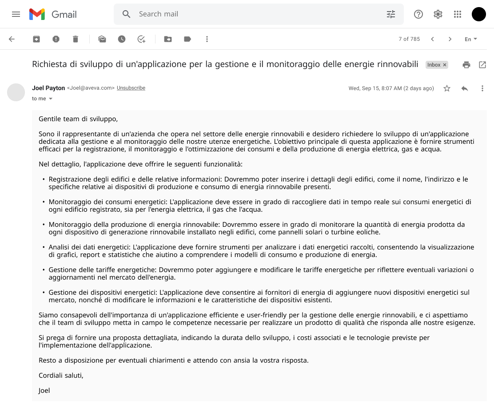
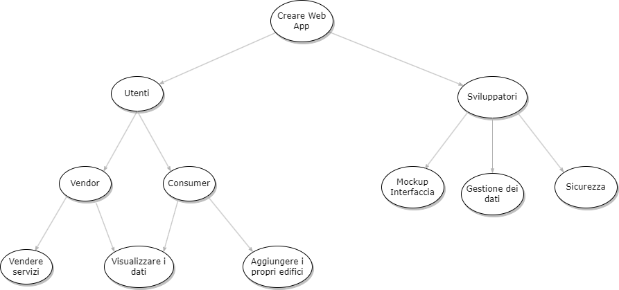

# Richiesta del committente

## Impact map

A seguito della richiesta precedentemente illustrata, il team di sviluppo ha deciso di produrre la seguente impact map, per riuscire a comprendere maggiormente il problema e formulare domande significative nelle successive interviste.

Impact map

Nell’immagine, il primo livello dell’impact map rappresenta l’obiettivo che si vuole ottenere: **La creazione della Web App**, gli attori coinvolti nel raggiungere questo obiettivo sono sia gli sviluppatori sia gli utenti che usufriscono del servizio. 

Nello specifico, gli sviluppatori dovranno:

- Pensare al template del sito
- Assicurare il libero mercato e la libera concorrenza
- Garantire la privacy dei dati e la sicurezza delle informazioni
- Realizzare un sistema veloce e intuitivo per tutte le categorie di utenti

Per poter raggiungere questi obiettivi il team di sviluppo dovrà lavorare prima sulla parte grafica, in modo da allinearsi con il committente sul design, poi dovrà gestire tutta la parte di gestione dei dati mentre gli utenti avranno come obiettivo quello di utilizzare la piattaforma per le loro esigenze, connettendosi al dominio realizzato da qualsiasi posto e con qualsiasi dispositivo.