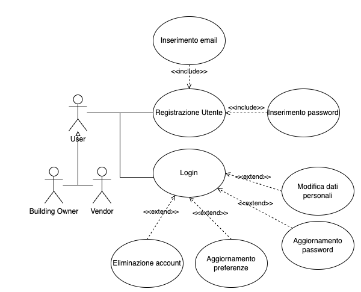
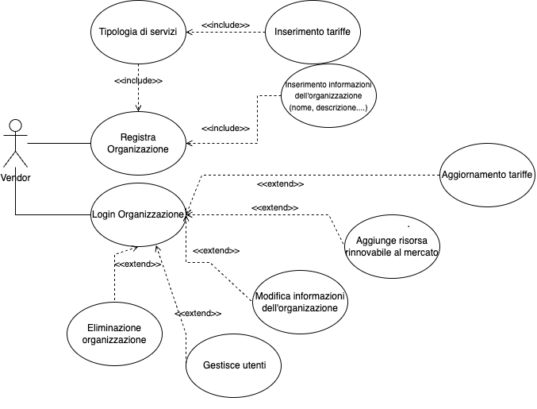
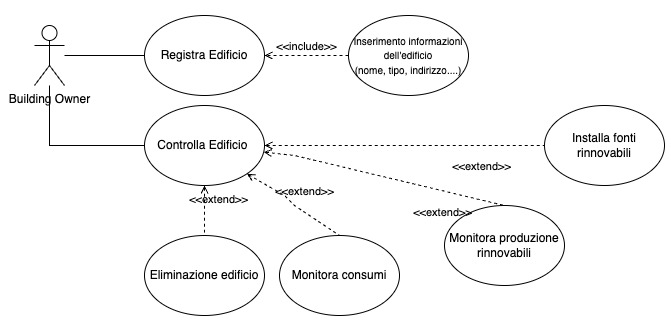

# Knowledge crunching

Dopo aver analizzato la richiesta che è stata effettuata e prodotto l’impact map si è tenuto la prima intervista con il committente, riportata di seguito.

**Analista**: La sua richiesta prevede la realizzazione di un marketplace per il monitoraggio e la vendita di risorse energetiche, come deve apparire il sito?

**Esperto**: Il sito deve avere alcuni elementi essenziali con un'iterfaccia intuitiva e user-friendly, per la loro disposizione vorrei avere alcuni mockup per valutare quale sia il migliore. In particolare avremmo due casi:

Per il **Vendor**:

- Visualizzazione (numerica e grafica) delle risorse vendute, del guadagno ottenuto e dei suoi clienti;
- KPI generali sui servizi venduti;
- Pannello dedicato sui dati delle risorse rinnovabili.

Per i **Customer**:

- Visualizzazione (grafica e numerica) del consumo di acqua, gas e luce;
- Visualizzazione della produzione delle fonti rinnovabili;
- Informazioni relative ai propri edifici registrati nel sistema;

**Analista**: Ha parlato di due target di utenti distinti, vorrei scendere più in profondità. Quali operazioni saranno effetuabili dal Vendor?

**Esperto**: Il Vendor ha accesso singolarmente ai servizi che offre (che sia acqua, gas o corrente) in modo da poter verificare nel dettaglio il consumo totale di tutti i suoi clienti in una determinata risorsa. In più ha la possibilità di vedere quale edificio sta consumando più energia e qual è il guadagno in quella particolare risorsa energetica. 
Ci deve essere poi una sezione dedicata all'aggiunta di dispotivi rinnovabili, in modo che i clienti possano poi scegliere se e quale installare; per inserire un nuovo dispositivo è necessario inserire il nome, il tipo, il prezzo e la produzione media stimata.
Non può mancare una sezione dove vengono visualizzati tutti i clienti con la possibilità di scendere più nel dettaglio e visualizzare le informazioni dell'edificio e i suoi consumi.
Infine l'organizzazione può modificare i suoi servizi, andando a cambiare il prezzo, il trasporto e il tipo di servizio offerto.

**Analista**: Riguardo l'organizzazione, che informazioni servono per registrarne una?

**Esperto**: Per registrare una nuova organizzazione è necessario indicare il nome di essa, il proprietario e una email, successivamente è possibile completare altri dettagli come il tipo di servizio che offre e tutti i prezzi. Inoltre il proprietario può:

- Modificare le sue informazioni personali;
- Visualizzare i login effettuati sul suo account;
- Decidere se mantenere salvati i log;
- Cambiare la password;
- Eliminare l'account.

**Analista**: Perfetto. Invece per quanto riguarda un Cliente, quali operazioni può effettuare?

**Esperto**: Il cliente ha la possibilità di visualizzare tutti gli edifici che sono registrati con il suo account, inizialmente questa sezione è vuota. Per inserire un nuovo edificio è necessario inserire il nome dell'edificio, la sua grandezza, il nome del proprietario, l'indirizzo e che organizzazione si vuole utilizzare. Quando si vogliono aggiornare le informazioni dell'edificio è possibile modificare tutti questi valori tranne l'indirizzo. Tramite una visualizzazione in dettaglio, sarà possibile visualizzare ogni singolo consumo, sia con grafici che con valori numerici, inoltre si possono vedere le produzioni rinnovabili o installarne di nuove.
Ci deve essere poi una sezione dove vengono presentate tutte le organizzazioni, in modo che un utente possa visualizzare i prezzi e i servizi per scegliere quella più adatta alle sue esigenze.
Infine è possibile visualizare la somma dei consumi filtrando per settimana, per mese o per anno, in più il tutto è visualizzato anche in forma grafica.

**Analista**: Invece per i Clienti quali sono i requisiti per registrarsi?

**Esperto**: Per i clienti è sufficiente nome e cognome insieme ad una email e una password. Come per le organizzazioni questi dati possono essere modificata dalla sezione personale. Deve esistere un controllo sugli accessi con possibilità di disattivarlo così come l'aggiornamento delle password.

**Analista**: Per il momento è tutto, se ha altre domande o richieste non esiti a contattarci.

**Esperto**: Certamente.

## Diagrammi dei casi d’uso

Dalle fasi precedenti dell'analisi, sono state identificati i seguenti casi d'uso principali:

Il seguente caso d'uso è relativo alla registrazione e accesso utente al sistema.
Gli attori in questo caso sono gli User che possono essere del tipo Building Owner o Vendor.
Entrambi possono registrarsi nel sistema tramite mail e password. Effettuato il login, questi potranno modificare i dati personali, aggiornare password e preferenze o eliminare l'account.

Diagramma dei casi d’uso: login utenti

Il seguente caso d'uso è relativo alla gestione dell'account Vendor, che è anche l'unico attore.
La prima volta è necessario registrarare la propria organizzazione, andando a completare tutti i campi con le informazioni necessarie. Successivamente sarà possibile fare il login e gestire gli utenti, le tariffe, le risorse e l'organizzazione.

Diagramma dei casi d’uso: vendor

Il seguente caso d'uso è relativo alla gestione dell'account Building Owner, che è anche l'unico attore.
La prima volta è necessario registrararsi, andando a completare tutti i campi con le informazioni necessarie. Successivamente sarà possibile fare il login e gestire i propri edifici, visualizzare i propri consumi e gestire le fonti rinnovabili.

Diagramma dei casi d’uso: building owner

## Domain storytelling

## Mockup
