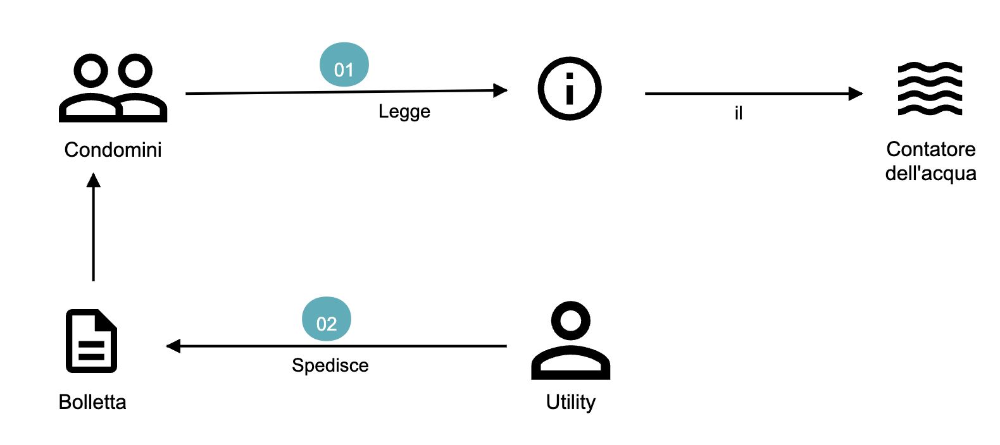
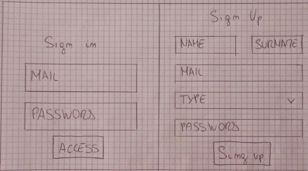
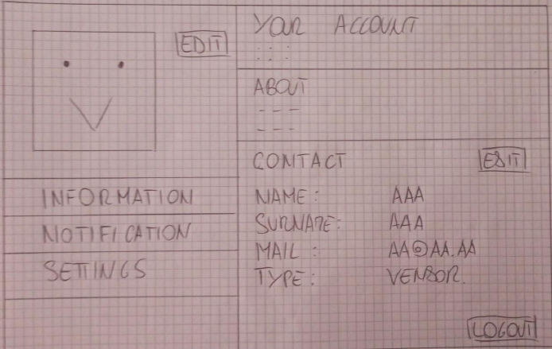
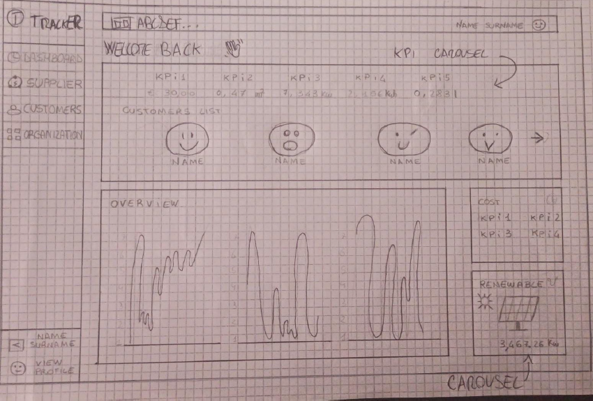
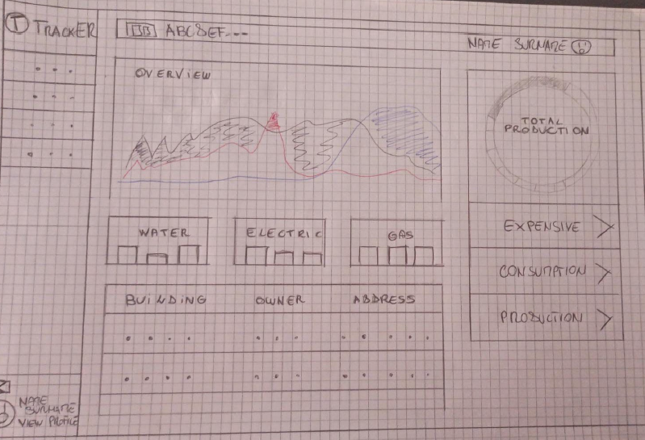
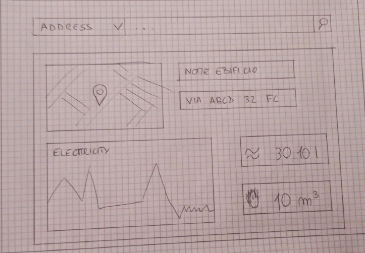

# Knowledge crunching

Dopo aver analizzato la richiesta che è stata effettuata e prodotto l’impact map si è tenuto la prima intervista con il committente, riportata di seguito.

**Analista**: La sua richiesta prevede la realizzazione di un marketplace per il monitoraggio e la vendita di risorse energetiche, come deve apparire il sito?

**Esperto**: Il sito deve avere alcuni elementi essenziali con un'iterfaccia intuitiva e user-friendly, per la loro disposizione vorrei avere alcuni mockup per valutare quale sia il migliore. In particolare avremmo due casi:

Per il **Vendor**:

- Visualizzazione (numerica e grafica) delle risorse vendute, del guadagno ottenuto e dei suoi clienti;
- KPI generali sui servizi venduti;
- Pannello dedicato sui dati delle risorse rinnovabili.

Per i **Customer**:

- Visualizzazione (grafica e numerica) del consumo di acqua, gas e luce;
- Visualizzazione della produzione delle fonti rinnovabili;
- Informazioni relative ai propri edifici registrati nel sistema;

**Analista**: Ha parlato di due target di utenti distinti, vorrei scendere più in profondità. Quali operazioni saranno effetuabili dal Vendor?

**Esperto**: Il Vendor ha accesso singolarmente ai servizi che offre (che sia acqua, gas o corrente) in modo da poter verificare nel dettaglio il consumo totale di tutti i suoi clienti in una determinata risorsa. In più ha la possibilità di vedere quale edificio sta consumando più energia e qual è il guadagno in quella particolare risorsa energetica. 
Ci deve essere poi una sezione dedicata all'aggiunta di dispotivi rinnovabili, in modo che i clienti possano poi scegliere se e quale installare; per inserire un nuovo dispositivo è necessario inserire il nome, il tipo, il prezzo e la produzione media stimata.
Non può mancare una sezione dove vengono visualizzati tutti i clienti con la possibilità di scendere più nel dettaglio e visualizzare le informazioni dell'edificio e i suoi consumi.
Infine l'organizzazione può modificare i suoi servizi, andando a cambiare il prezzo, il trasporto e il tipo di servizio offerto.

**Analista**: Riguardo l'organizzazione, che informazioni servono per registrarne una?

**Esperto**: Per registrare una nuova organizzazione è necessario indicare il nome di essa, il proprietario e una email, successivamente è possibile completare altri dettagli come il tipo di servizio che offre e tutti i prezzi. Inoltre il proprietario può:

- Modificare le sue informazioni personali;
- Visualizzare i login effettuati sul suo account;
- Decidere se mantenere salvati i log;
- Cambiare la password;
- Eliminare l'account.

**Analista**: Perfetto. Invece per quanto riguarda un Cliente, quali operazioni può effettuare?

**Esperto**: Il cliente ha la possibilità di visualizzare tutti gli edifici che sono registrati con il suo account, inizialmente questa sezione è vuota. Per inserire un nuovo edificio è necessario inserire il nome dell'edificio, la sua grandezza, il nome del proprietario, l'indirizzo e che organizzazione si vuole utilizzare. Quando si vogliono aggiornare le informazioni dell'edificio è possibile modificare tutti questi valori tranne l'indirizzo. Tramite una visualizzazione in dettaglio, sarà possibile visualizzare ogni singolo consumo, sia con grafici che con valori numerici, inoltre si possono vedere le produzioni rinnovabili o installarne di nuove.
Ci deve essere poi una sezione dove vengono presentate tutte le organizzazioni, in modo che un utente possa visualizzare i prezzi e i servizi per scegliere quella più adatta alle sue esigenze.
Infine è possibile visualizare la somma dei consumi filtrando per settimana, per mese o per anno, in più il tutto è visualizzato anche in forma grafica.

**Analista**: Invece per i Clienti quali sono i requisiti per registrarsi?

**Esperto**: Per i clienti è sufficiente nome e cognome insieme ad una email e una password. Come per le organizzazioni questi dati possono essere modificata dalla sezione personale. Deve esistere un controllo sugli accessi con possibilità di disattivarlo così come l'aggiornamento delle password.

**Analista**: Per il momento è tutto, se ha altre domande o richieste non esiti a contattarci.

**Esperto**: Certamente.

## Diagrammi dei casi d’uso

Dalle fasi precedenti dell'analisi, sono state identificati i seguenti casi d'uso principali:

Il seguente caso d'uso è relativo alla registrazione e accesso utente al sistema.
Gli attori in questo caso sono gli User che possono essere del tipo Building Owner o Vendor.
Entrambi possono registrarsi nel sistema tramite mail e password. Effettuato il login, questi potranno modificare i dati personali, aggiornare password e preferenze o eliminare l'account.

Diagramma dei casi d’uso: login utenti

Il seguente caso d'uso è relativo alla gestione dell'account Vendor, che è anche l'unico attore.
La prima volta è necessario registrarare la propria organizzazione, andando a completare tutti i campi con le informazioni necessarie. Successivamente sarà possibile fare il login e gestire gli utenti, le tariffe, le risorse e l'organizzazione.

Diagramma dei casi d’uso: vendor

Il seguente caso d'uso è relativo alla gestione dell'account Building Owner, che è anche l'unico attore.
La prima volta è necessario registrararsi, andando a completare tutti i campi con le informazioni necessarie. Successivamente sarà possibile fare il login e gestire i propri edifici, visualizzare i propri consumi e gestire le fonti rinnovabili.

Diagramma dei casi d’uso: building owner

## Domain storytelling
Dopo aver sviluppato i diagrammi dei casi d'uso, il team di sviluppo ha programmato una seconda intervista con gli abitanti di un condominio, appartenente al committente, per raccogliere ulteriori informazioni sul dominio e le dinamiche coinvolte nel sistema.

Durante questa seconda intervista, è stata adottata la strategia del domain storytelling. Gli esperti del dominio, che in questo caso sono gli abitanti del condominio, sono stati invitati a raccontare come verificano i consumi della propria abitazione e quali aspettative e risultati si aspettano dal sistema proposto. Nel frattempo, il team di sviluppo ha registrato attentamente il racconto degli esperti utilizzando un linguaggio pittografico.

Di seguito viene presentato il risultato di questa seconda intervista, in cui ogni user story è stata illustrata attraverso le domande poste dall'analista agli abitanti e un apposito diagramma utilizzando un linguaggio pittografico.

**Analista**: Attualmente come verificate i vostri consumi energetici?

**Esperto(condomino-1)**: Attualmente verifico i consumi elettrici tramite posta. Ogni due mesi controllo i consumi a posteriori.
**Esperto(condomino-2)**: Verifico mensilmente il livello di consumo dal contatore dell'acqua. Scomoda come operazione perchè abitando al terzo piano, devo recarmi fuori nel viale dove risiede il pozzetto con il contatore dell'acqua.
**Esperto(condomino-3)**: Attualmente non mi occupo di visionare questi dati ma pago le bollette.

Domain story telling: controllo attuale delle bollette

**Analista**: Se esistesse un'applicazione in grado di visionare questi dati in tempo reale, come vorreste accedervi?

**Esperto(condomino-1)**: Lavorando in ufficio mi piacerebbe poter visionare i dati dal computer.
**Esperto(condomino-2)**: Spesso effettuo viaggi d'affari e mi sarebbe comodo controllare il tutto dal mio telefono.
**Esperto(condomino-3)**: Adoro le applicazioni, mi piacerebbe averla ovunque.

**Analista**: Come vorreste che funzionasse il sistema? Come vorreste che fosse organizzata nelle diverse schermate?

**Esperto(condomino-1)**: Mi piacerebbe che fosse molto intuitiva e che i dati balzassero subito all'occhio. Vorrei anche essere in grado di visionare i dati più nel dettaglio.
**Esperto(condomino-2)**: Divisa in sezioni semplici in grado di visionare i dati d'interesse il più velocemente possibile. 
**Esperto(condomino-3)**: Mi piacerebbe avere degli avatar utente. 

**Analista**: Per più nel dettaglio cosa intende?

**Esperto(condomino-1)**: Aver la possibilità di visionare i vari consumi in categorie settimanali, mensili e annuali.

Domain story telling: applicazione web

## Mockup

A seguito delle interviste effettuate e grazie alle informazioni finora raccolte, il team di sviluppo ha prodotto i seguenti mock-up relativi all’applicazione web richiesta dal committente. Tali mock-up sono stati presentati e discussi assieme agli esperti del domino, in modo da poter verificare la loro correttezza e in caso modificarli per meglio adattarli alle loro richieste.

**Sign In / Sign Up**

Per la form di Sign In / Sign Up all’applicazione si è pensato di suddividere l’accesso e la registrazione all’applicazione in una singola schermata per non disperdere
l’utente nelle varie pagine del sistema. La registrazione richiederà il tipo di utente che si vuole creare (Vendor o Buildings Owner) mentre per accedere al sistema sarà necessario effettuare il Sign In tramite Mail e Password. Per passare da un form all'altro è possibile usare uno slider orizzontale.

Mock-up Sign In e Sign Up

**Personal Account**

Per la pagina Account si è pensato di creare due sezioni:
- Una con un menù di navigazione sulle varie iterazioni che l’utente può fare con il suo account(parte sinistra);
- Una inerente alla renderizzazione dei dati provenienti dalla sezione precedente(parte destra).
La differenza sostanziale tra le due tipologie di account per questa pagina sarà inerente alla personalizzazione dell’avatar in cui, un Vendor, potrà caricare il logo della sua organizzazione mentre un Buildings Owner potrà selezionare un avatar presente nel sistema.

Mock-up Personal Account

**Vendor Dashboard**

La Vendor DashBoard avrà come obiettivo principale quello di dare una visione generale sui costi e guadagni di un Vendor. Questa pagina sarà composta da grafici inerenti ai consumi utente, un collegamento veloce agli edifici utente e una vasta gamma di KPI.

Mock-up Vendor Dashboard

**Building Owner Dashboard**

La Buildings Owner DashBoard sarà molto simile alla Vendor DashBoard ma il suo obiettivo principale sarà quello di dare una visione generale sui consumi e risparmi energetici di un Buildings Owner. Questa pagina avrà meno KPI rispetto a quella vendor ma conterrà più grafici inerenti ai consumi.

Mock-up Building Owner Dashboard

**Building Page**

La Buildings Page sarà composta da più interfacce che rappresentano un singolo edificio. Ogni edifico mostrerà la propria ubicazione tramite una mappa, le sue informazioni principali e i suoi costi totali. Si permetterà inoltre ad un utente di poter cercare i propri edifici tramite nome edificio e indirizzo edificio.

Mock-up Buildings Page

