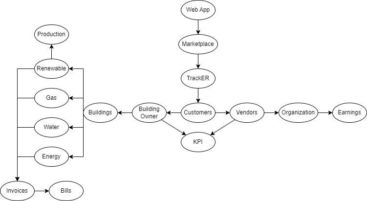

# Ubiquitous language

Durante le varie sessioni di consultazione con gli esperti del dominio, il team di sviluppo ha dedicato tempo ed energie alla ricerca dei termini che costituiscono l’ubiquitous language, emersi durante gli incontri.

Di seguito è possibile vedere un’immagine raffigurante i diversi termini individuati e le relazioni che vi sono fra di essi.

Ubiquitous language

| Termine | Definizione |
| --- | --- |
|TrackER|Combinazione dei termini "track" (tracciare) e "EnergyResources" (risorse energetiche). Applicazione che monitora e traccia le risorse energetiche|
|Web app|Applicazione basata sul web, accessibile attraverso un browser internet|
|Marketplace|Luogo virtuale/piattaforma online in cui i prodotti o servizi di diversi venditori sono messi in vendita o offerti agli acquirenti|
|Customers|Persone o entità che acquistano o utilizzano i prodotti o servizi dell'azienda|
|Vendors|Persone o entità che forniscono prodotti o servizi|
|Building Owner|Proprietario di edifici e immobili|
|Earnings|Profitto maturato da un'azienda o un individuo|
|Organization|Un'entità strutturata, come un'azienda o un'associazione, che ha uno scopo o un obiettivo comune|
|Bills|Documenti che rappresentano richieste di pagamento per beni o servizi forniti|
|Production|Energia prodotta da risorse rinnovabili|
|Buildings|Strutture fisiche, come edifici, che sono state costruite o sono in costruzione|
|Invoices|Documenti che elencano i beni o i servizi forniti e il loro costo, inviati agli acquirenti per il pagamento|
|Water|Una risorsa utilizzata per scopi domestici, industriali e agricoli|
|Gas|Una forma di combustibile utilizzata per scopi domestici, industriali o veicolari|
|Energy|La capacità di fare lavoro o produrre un effetto, spesso in forma di elettricità o combustibile|
|Renewable|Riferito a fonti di energia o risorse che possono essere rigenerate o ripristinate naturalmente nel tempo|
|KPI|Indicatori utilizzati per valutare le performance e il raggiungimento degli obiettivi|
