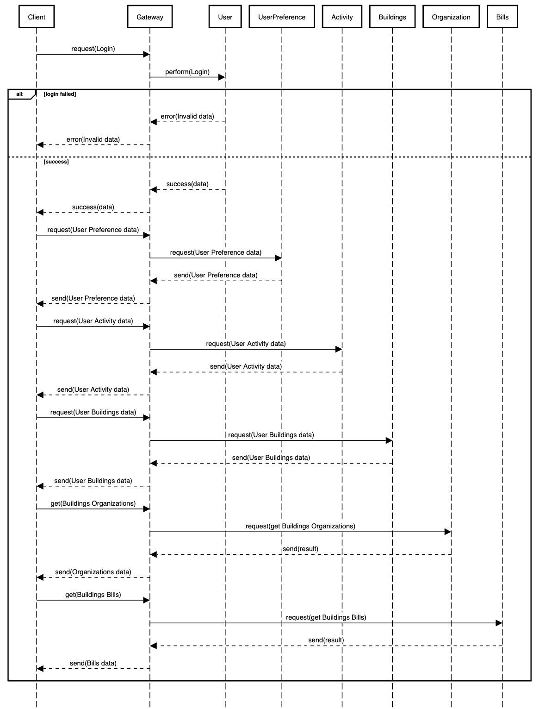

# Sistema di backend

Una volta individuati i bounded context presenti all'interno del sistema di backend è necessario individuare una strategia di integrazione tale per cui i bounded context al suo interno siano il più autonomi possibili; solo in questo modo si possono evitare ad esempio dei rallentamenti o indisponibilità del sistema. A seguito dell'analisi dei requisiti e considerando l'autonomia dei bounded context, si è quindi scelto di realizzare un'architettura a micro-servizi, la quale porta con se diversi vantaggi, come: l'isolamento degli errori a singoli componenti del sistema, una maggiore scalabilità, semplicità nel deployment etc.

Come detto precedentemente, nell'introduzione del Design, sono stati individuati otto micro-servizi: Activity, Bills, Buildings, Gateway, Organization, Preferences, Renewable, Users.

I diversi micro-servizi realizzati hanno tutti caratteristiche simili, ossia:

- Connessione al database: Viene chiamata la funzione connectToDatabase() dal modulo database.service per stabilire la connessione al database. Questo modulo non è incluso nel codice fornito, ma probabilmente contiene la logica per gestire la connessione al database.

- Configurazione delle variabili di ambiente: Viene utilizzato dotenv.config() per caricare le variabili di ambiente dal file .env.

- Configurazione del server: Viene creato un'istanza di Express chiamata app. Vengono utilizzati app.use(cors()) per abilitare le richieste cross-origin e app.use(express.json()) per consentire la lettura dei dati JSON nelle richieste.

- Utilizzo delle route: Viene utilizzato app.use(router) per utilizzare le rotte definite nel modulo route. Il modulo delle rotte, che viene importato come router, gestirà le richieste in arrivo alle varie rotte dell'applicazione.

- Avvio del server: Viene chiamato il metodo app.listen(port, callback) per avviare il server. Il server ascolterà le richieste sulla porta specificata nella variabile di ambiente process.env.PORT. Quando il server è in ascolto, verrà stampato un messaggio sulla console.

- Esportazione dell'app: Viene esportato l'oggetto app, che rappresenta l'istanza di Express, in modo che possa essere utilizzato altrove nell'applicazione.

In base a quanto detto in precedenza, è possibile dedurre che un micro-servizio possa svolgere sia il ruolo di **server**, ovvero accettare le richieste provenienti da altri micro-servizi in esecuzione, sia il ruolo di **client**, ovvero inviare richieste ad altri micro-servizi con cui comunica al fine di completare le proprie attività.

## Interazione tra i diversi micro-servizi

I diversi micro-servizi, per poter svolgere le loro funzioni, hanno la necessità di comunicare e interagire tra loro. In dettaglio l’interazione coinvolge il Client, Desktop o Mobile. In questo caso le interazioni che possono avvenire da e verso il client, passano tutte per il servizio Gateway. Nel caso delle richieste effettuate dal Client verso il sistema di backend, il servizio può comunicare con uno dei micro-servizi, qualora fosse interessato a reperire le informazioni relative a quel particolare micro-servizio.

 
Interazione dei micro-servizi

Di seguito viene mostrato il comportamento del server nel caso in cui un utente qualsiasi effettui il login. Nell’esempio in questione i servizi coinvolti sono:
- `Activity`, si occupa di registrare ogni accesso al sito, l'ora e la posizione (Per entrambe le tipologie di utenti);
- `Bills`, si occupa di memorizzare tutti consumi elettrici, di gas e di acqua relaivi a un particolare edificio;
- `Buildings`, si occupa di registrareogni tipologia di edificio, il proprietario e tutti i vari parametri;
- `Gateway`, si occupa di smistare le comunicazioni ai diversi microservizi;
- `Organization`, si occupa della gestione delle singole organizzazioni, i prezzi dei vari servizi e tutti i dettagli;
- `Preferences`, si occupa di salvare le preferenze degli utenti come ad esempio l'avatar del profilo;
- `Users`, si occupa di registrare ogni utente, i suoi dati e la sua tipologia.

Come si può vedere dal diagramma, quando un utente effettua il login, se le credenziali sono sbagliate verrà mostrato un errore; al contrario se sono corrette il client andrà a richiedere tutti i dati necessari. Prima di tutto recupera le preferenze dell'utente, poi regista l'attività di accesso, richiede le bills per poter mostrare i dati e i grafici e infine recupera la lista degli edifici dell'utente così come l'organizzazione legata a ciascun immobile.

 
Diagramma di sequenza del server

