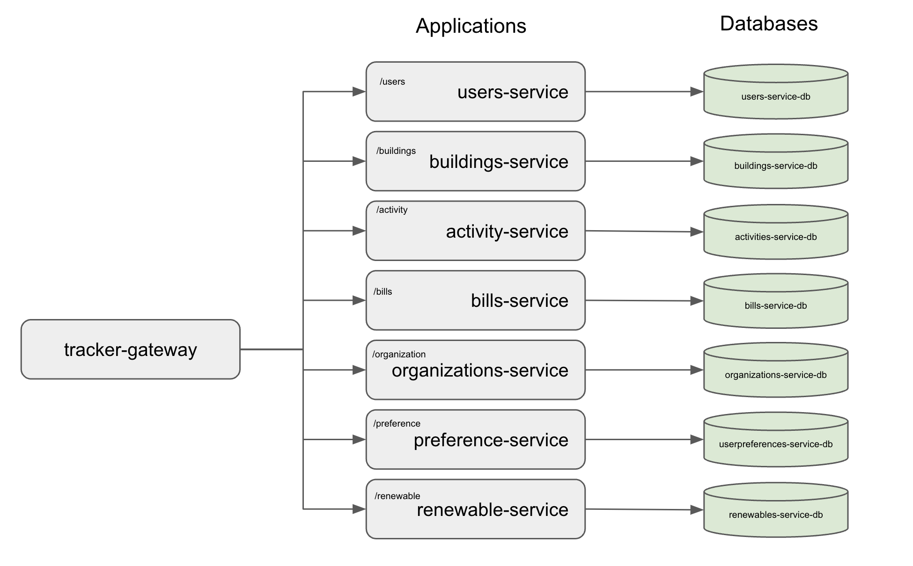

# Design

Le componenti del sistema che si vuole andare a realizzare sono due: il sistema backend e quello frontend che include il client Desktop e Mobile.

Per realizzare il sistema di backend, si è deciso di adottare un'architettura a microservizi. Sono stati individuati otto microservizi principali:

- **Activity**, si occupa di registrare ogni accesso al sito, l'ora e la posizione (Per entrambe le tipologie di utenti);
- **Bills**, si occupa di memorizzare tutti consumi elettrici, di gas e di acqua relaivi a un particolare edificio;
- **Buildings**, si occupa di registrareogni tipologia di edificio, il proprietario e tutti i vari parametri;
- **Gateway**, si occupa di smistare le comunicazioni ai diversi microservizi;
- **Organization**, si occupa della gestione delle singole organizzazioni, i prezzi dei vari servizi e tutti i dettagli;
- **Preferences**, si occupa di salvare le preferenze degli utenti come ad esempio l'avatar del profilo;
- **Renewable**, si occupa di memorizzare tutti i dispositivi rinnovabili che le diverse organizzazioni mettono a disposizioni;
- **Users**, si occupa di registrare ogni utente, i suoi dati e la sua tipologia.

Possiamo inoltre notare che:

- Ogni microservizio è connesso allo stesso database, diviso in sezioni (una per ogni servizio);
- C'è un gateway che si occupa di collegare l'app a tutti i vari servizi, implicando che tutte le comunicazione che partono dal client o devono arrivare al client passano dal Gateway.

 
Architettura server

Per quanto riguarda il frontend del sistema, si è utilizzato React, un framework JavaScript ampiamente utilizzato per la creazione di interfacce utente reattive e riutilizzabili.
React consente di strutturare l'applicazione utilizzando un'architettura basata sui componenti.
I componenti sono autonomi e riutilizzabili, il che favorisce la modularità e la manutenibilità del codice.