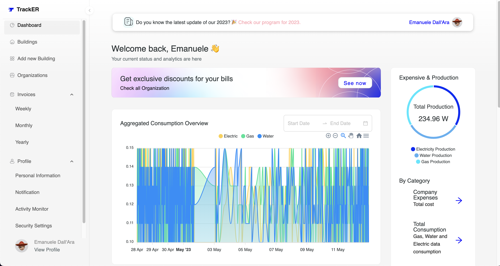

# Dettagli implementativi Client
Per realizzare le parti del sistema si è cercato di seguire il più possibile un approccio modulare, cosicché l’eventuale aggiunta o rimozione di funzionalità sia il più semplice e meno impattante possibile.
In questa sezione verranno discussi i dettagli implementativi, più rilevanti secondo il team di sviluppo, del client realizzato.


## Redux

Redux è una libreria di gestione dello stato. È stato ampiamente utilizzata per gestire lo stato globale condiviso tra i componenti e pagine dell'applicazione.

La principale caratteristica di Redux è la centralizzazione dello stato dell'applicazione. Invece di memorizzare lo stato in diversi componenti, Redux utilizza uno store centralizzato che contiene l'intero stato dell'applicazione. Questo permette di mantenere un flusso di dati prevedibile e coerente all'interno dell'applicazione.

Tramite degli eventi, viene aggiornato lo stato dello store globale attraverso la funzione specifica di redux: ``dispatch``. 

```typescript
// Store globale utilizzato
export const store = configureStore({
  reducer: {
    user: userSlice.reducer,
    preference: preferenceSlice.reducer,
    buildings: buildingsSlice.reducer,
    organization: organizationSlice.reducer,
    allOrganization: allOrganizationSlice.reducer,
    allUser: allUserSlice.reducer
  },
})

export type RootState = ReturnType<typeof store.getState>
export type AppDispatch = typeof store.dispatch
```
I ``reducers`` sono funzioni pure che specificano come lo stato viene modificato in risposta ad un'azione.

```typescript
// Building Reducer utilizzato 
import { createSlice } from '@reduxjs/toolkit'
import { Building } from '../types'


const buildings = localStorage.getItem("buildings")

interface InitState {
    buildings: Array<Building>
}

const initialState: InitState = {
    buildings: buildings ? JSON.parse(buildings) : {},
}


export const buildingsSlice = createSlice({
    name: 'buildings',
    initialState: initialState,
    reducers: {
        fetchBuildings: (state, action) => {
            state.buildings = action.payload
            localStorage.setItem("buildings", JSON.stringify(action.payload))
        },
    },
})

export const { fetchBuildings } = buildingsSlice.actions

export default buildingsSlice.reducer
```

Per utilizzare al meglio Redux, si è aggiunto la tipizzazione offerta da Typescript come segue: 

```typescript
export const useAppDispatch: () => AppDispatch = useDispatch
export const useAppSelector: TypedUseSelectorHook<RootState> = useSelector

// Esempio di dispatch
const dispatch = useAppDispatch()
dispatch(fetchBuildings(updateBuildings))

// Esempio di estrazione dei dati buildings dallo store globale
  const buildings = useAppSelector((state) => state.buildings.buildings)


```

In questo modo è stato possibile risalire alle proprietà di ciascun reducer all'interno dello store durante la fase di programmazione.

## React Router
Per definire di navigazione tra le pagine dell'applicazione web si è utilizzata la libreria React Router.
Questa permette di definire in modo dichiarativo le diverse "pagine" o "viste" dell'applicazione e di gestirne la navigazione in modo semplice. Utilizza componenti React come ``Router`` e ``Route`` per definire le route e i componenti corrispondenti. Supporta anche route parametriche e la gestione del nesting delle route. 

```typescript
// Router globale utilizzato nell'applicazione
 <div>
      {show && logged ? type === "Vendor" ?
        <BrowserRouter children={<VendorRoutes />} />
        :
        <BrowserRouter children={<DashboardRoutes />} />
        :
        <BrowserRouter>
          <Nav key="Nav3_0" dataSource={Nav30DataSource} isMobile={isMobile} />
          <Routes>
            <Route path="/" element={<Home />} />
            <Route path="*" element={<Home />} />
            <Route path="/Home" element={<Home />} />
            <Route path="/Service" element={<Service />} />
            <Route path="/Access" element={<Login />} />
          </Routes>
          <Footer key="Footer1_0" dataSource={Footer10DataSource} isMobile={isMobile} />
        </BrowserRouter>
      }
    </div>
```

## Axios
Axios è una libreria JavaScript molto popolare che semplifica notevolmente le operazioni di comunicazione HTTP in un'applicazione client. In particolare, Axios è ampiamente utilizzato nelle applicazioni React per inviare richieste a un server backend e gestire le risposte ricevute.

Una delle principali ragioni per cui Axios è molto utile è la sua facilità d'uso. Axios fornisce un'API semplice e intuitiva per effettuare richieste HTTP, che si integra facilmente con i componenti React.

Nel Client Axios viene utilizzato per effettuare una richiesta HTTP GET tramite il metodo axios.get(). Questo metodo accetta come parametro l'URL del server backend a cui si desidera inviare la richiesta.

Una caratteristica importante di Axios è il supporto alle promise. Utilizzando la parola chiave async e await, possiamo aspettare che la richiesta HTTP venga completata e ottenere la risposta dal server, tilizziando await axios.get() per aspettare la risposta dalla richiesta GET e successivamente utilizziando response.data per accedere ai dati della risposta ricevuta dal server.

Questa risposta può essere elaborata ulteriormente nel componente React. Ad esempio, i dati possono essere memorizzati nello stato utilizzando useState hook di React.

Una volta ottenuti i dati, possono essere visualizzati all'interno del componente React utilizzando il normale flusso di rendering di React, come ad esempio il mapping dell'array data e la creazione di elementi React corrispondenti a ciascun elemento.

All'interno dell'applicazione, Axios è stato quindi responsabile della comunicazione HTTP ossia il punto di collegamento tra il client e i microservizi.

```typescript

// Frammento di codice axios utilizzato nell'applicazione

export default {
activity: {
        fetchActivity: (userId: string) =>
            axios.get(`${API_URL}/activity/${userId}`)
                .then((res) => res.data),
        updateActivity: (userId: string) =>
            axios.post(`${API_URL}/activity`, { userId: userId })
                .then((res) => res.data),
    }
}

// Esempio di utilizzo
api.activity.fetchActivity(userId).then(res=> console.log(res))
```

## UI Development
Per la realizzazione dell'interfaccia utente sono state ampiamente utilizzate le librerie **Ant Design**, **Apexchart** e **styled-components**

Ant Design è una libreria di componenti UI che offre una vasta gamma di elementi per la creazione di interfacce utente moderne e reattive. La libreria fornisce un design system completo e una vasta gamma di componenti pronti all'uso, come pulsanti, form, tabelle e modali. I componenti sono altamente personalizzabili e supportano funzionalità avanzate come la validazione dei form e la paginazione.

ApexCharts è una libreria di visualizzazione dei dati ampiamente utilizzata nello sviluppo della web application. 
Fornisce una soluzione semplice ed elegante per creare grafici avanzati. Supporta diversi tipi di grafici, come linee, aree, colonne, torte e altro ancora ed offre anche una vasta gamma di esempi e tutorial 

```typescript
// Esempio di renderizzazione di un grafico ad area
<ReactApexChart options={options} series={data} type="area" height={350} />
```

Styled-components è una libreria di stile in linea per React che consente di definire e utilizzare componenti React con stili CSS direttamente nel codice. È possibile creare componenti reattivi e stilizzati in modo dichiarativo, utilizzando sintassi simile a CSS, ma con la potenza e la flessibilità di TypeScript. I CSS vengono scritti all'interno delle definizioni dei componenti, rendendo i componenti auto-contenuti e facilmente riutilizzabili. styled-components facilita la gestione dello stato dei componenti e offre funzionalità avanzate come l'ereditarietà dei componenti e le animazioni.

```typescript
// Esempio di div personalizzato

const Center = styled.div`
display: flex;
align-items: center;
justify-content: center;
flex-direction: column;
text-align: center;
`
```


 <div align="center">

 <p align="center">Dashboard Building Owner composta da componenti di Ant Design e ApexChart personalizzati con styled-components</p>
</div>