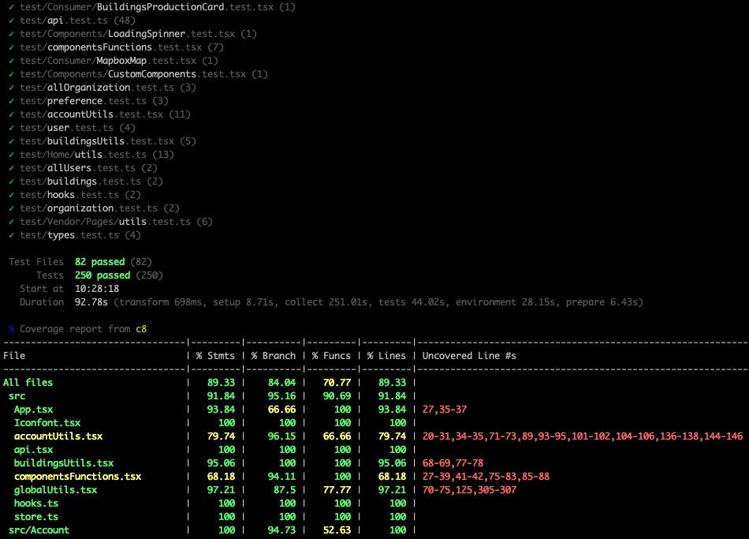

# Testing

Per verificare il corretto comportamento del sistema e l’efficacia del prodotto realizzato si è proceduto a testare le diverse componenti del sistema sia tramite test manuali, che mediante test automatici. Nelle seguenti sezioni verranno definiti con maggiore dettaglio i test realizzati.

## Testing del Server

Nel progetto del Server sono stati effettuati test automatici con **Vitest** per garantire la qualità del codice e verificare che tutte le funzionalità siano correttamente implementate. 

Qusta libreria include anche un contesto di testing per le esecuzioni asincrone. In tal modo, è possibile avviare i singoli servizi in modo asincrono e tramite l’effettuazione di richieste HTTP automatiche, è possibile verificare le risposte restituite dal servizio in modo semplice e agevole. 

Si è cercato di testare la maggior parte dei componenti in tutti i microservizi, ottenendo una coverage complessiva di: 

| Stmts | Branch | Funcs | Lines |
| :---: | :---: | :---: | :---: |
| 80.40 | 78.48 | 97.475 | 80.40 |

In particolare, di seguito verrà rappresentata la coverage per ogni singolo servizio:

Activity

| Stmts | Branch | Funcs | Lines |
| :---: | :---: | :---: | :---: |
| 97.02 | 88.23 | 100 | 97.02 |

Bills

| Stmts | Branch | Funcs | Lines |
| :---: | :---: | :---: | :---: |
| 65.15 | 87.5 | 87.5 | 65.15 |

Buildings

| Stmts | Branch | Funcs | Lines |
| :---: | :---: | :---: | :---: |
| 67.85 | 58.13 | 100 | 67.85 |

Gateway

| Stmts | Branch | Funcs | Lines |
| :---: | :---: | :---: | :---: |
| 96.29 | 87.5 | 100 | 96.29 |

Organization

| Stmts | Branch | Funcs | Lines |
| :---: | :---: | :---: | :---: |
| 74.01 | 72.41 | 100 | 74.01 |

Preferences

| Stmts | Branch | Funcs | Lines |
| :---: | :---: | :---: | :---: |
| 89.92 | 87.09 | 100 | 89.92 |

Renewable

| Stmts | Branch | Funcs | Lines |
| :---: | :---: | :---: | :---: |
| 86.79 | 81.08 | 100 | 86.79 |

Users

| Stmts | Branch | Funcs | Lines |
| :---: | :---: | :---: | :---: |
| 66.18 | 65.9 | 92.3 | 66.18 |

Oltre ai test automatici, sono stati eseguiti anche test manuali per verificare il corretto funzionamento del sistema nel suo insieme, includendo la comunicazione con i clients.

## Testing del Client

Anche per il Client sono stati realizzati dei test automatici per verificare il corretto funzionamento dell'applicazione. In particolare è stato utilizzato sempre **Vitest** per testare sia la logica che le interfacce.

Tuttavia, siccome il sistema è distribuito, non è stato possibile testare tutte le funzionalità dell'applicazione in quanto richiede che i micro-servizi siano attivi e in esecuzione. La coverage finale ottenuta (con 250 test) è la seguente:

| Stmts | Branch | Funcs | Lines |
| :---: | :---: | :---: | :---: |
| 89.33 | 84.04 | 70.77 | 89.33 |

In conclusione, sono stati eseguiti test manuali su piattaforme MacOS e Windows al fine di verificare il corretto funzionamento dell'applicazione. Inizialmente, sono stati eseguiti test sulle singole pagine per accertarsi che le richieste al server fossero gestite correttamente e che tutte le informazioni necessarie venissero visualizzate all'utente. Inoltre, è stato verificato che l'aggiornamento dei dati funzionasse correttamente. Successivamente, sono state integrate le diverse schermate per garantire che il comportamento complessivo dell'applicazione rimanesse invariato. Infine, è stato verificato che l'interfaccia fosse responsiva alle azioni dell'utente, mantenendo tutte le altre funzionalità.

 
Coverage ottenuta per il Client

