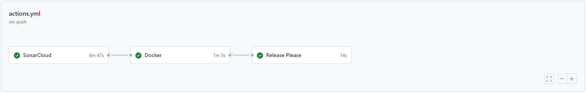

# Continuous integration

La *Continuous Integration* è una pratica importante nello sviluppo del software che consiste nel compilare, testare e distribuire frequentemente il codice sorgente in modo da garantire che le modifiche non introducano errori nel software esistente.

Come detto nei capitoli precedenti, il codice del sistema è organizzato in più repository, per cui è stato realizzato un processo di automazione per ogni repository tramite l'utilizzo delle **GitHub Actions**. 

Di seguito, verranno descritte le configurazioni di *Cotinuous Integration* eseguite per ogni progetto.

## TrackER UI

In questo caso viene preso come esempio il servizio che gestisce la parte UI del progetto ma anche tutti gli altri microservizi utilizzano lo stesso pattern. 

- Il primo job eseguito è _sonarcloud_, una piattaforma che consente il controllo automatico del codice per rilevare e identificare errori di sintassi, bug, falle nella sicurazzza e duplicazione di codice. 

- Il secondo job è _Docker_, che si occupa del deployment dell'applicazione in container Docker.

- Il terzo job è _Release Please_, che si occupa di creare la nuova release.

 
[Fig 1] Pipeline implementata per i vari microservizi

